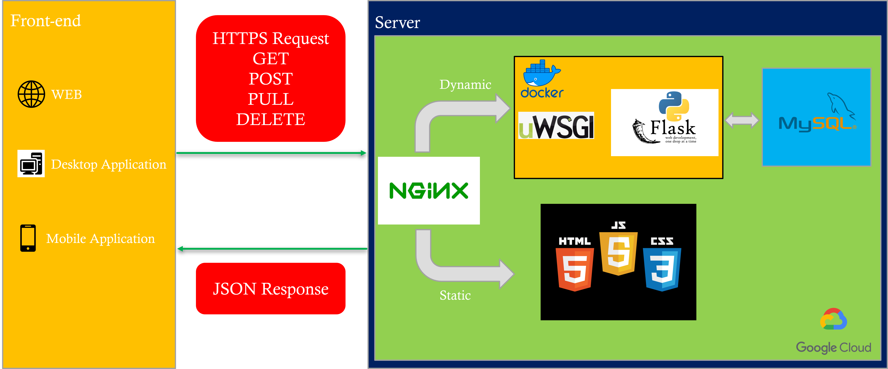

# G13_Q&A Platform
This is a restful api based on python-flask. Project Architecture: flask+mysql+uwsgi+docker+nginx.

Version: v1

Contributors: 
    [Ruowei Zhao](https://github.com/zhaoruowei),
    [Yuting MA](),
    [Feiye Pan](),
    [Tianbao Zhang]()

**Command to pull docker image**
```
docker pull zhaoruowei/g13_qa_flask_api:v1
```
## About


## Architecture



###### Disclaimer 
This mini-project is an assignment for the Cloud Computing course taught by [Dr. Sukhpal Singh Gill](https://github.com/iamssgill) at the Queen Mary University of London Electrical Engineering & Computer Science Department for the 2021-2022 academic year.